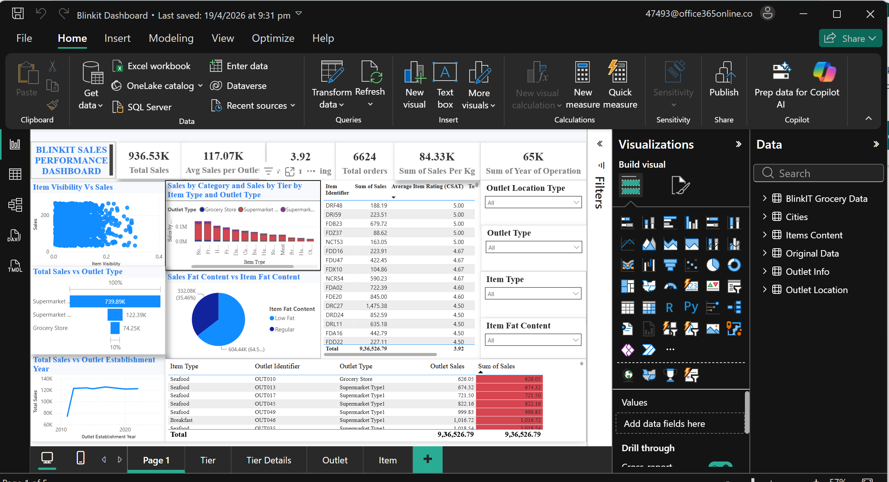

# 📊 Blinkit Sales Performance Dashboard

An interactive Power BI dashboard analyzing sales performance for Blinkit — covering total sales, orders, item ratings, outlet types, tiers, and category-level trends.

## Key Metrics

| Metric | Value |
|---|---|
| Total Sales | 936.53K |
| Avg Sales per Outlet | 117.07K |
| Total Orders | 6,624 |
| Sum of Sales per Kg | 84.33K |
| Sum of Year of Operation | 65K |

## What's inside

- **Item Visibility vs Sales** — scatter plot showing how item shelf visibility relates to sales
- **Sales by Category and Sales by Tier** — combo chart broken down by item type and outlet type
- **Total Sales vs Outlet Type** — bar chart comparing Supermarket Type 1/2 and Grocery Store performance
- **Sales Fat Content vs Item Fat Content** — pie chart split between Low Fat and Regular items
- **Total Sales vs Outlet Establishment Year** — trend line of sales by the year outlets opened
- **Detailed tables** — item-level sales, average CSAT ratings, and outlet-level sales breakdown
- **Interactive filters** — Outlet Location Type, Outlet Type, Item Type, Item Fat Content
- **Multiple report pages** — Page 1 (Overview), Tier, Tier Details, Outlet, Item

## Tools & Tech

- Power BI Desktop
- DAX (calculated measures and columns)
- Power Query (data transformation)

## How to view

1. Download `Blinkit_Sales_Analysis_PowerBI.pbix` from this repo
2. Open it in [Power BI Desktop](https://www.microsoft.com/en-us/power-platform/products/power-bi/downloads) (free)
3. Explore the pages using the tabs at the bottom: **Page 1, Tier, Tier Details, Outlet, Item**
4. Use the filter panel on the right (Outlet Type, Item Type, etc.) to slice the data interactively

## Data Model

The report is built on the following tables (visible in the Data pane):
- BlinkIT Grocery Data
- Cities
- Items Content
- Original Data
- Outlet Info
- Outlet Location

## Sample Insights

- Supermarket Type 1 outlets drive the majority of total sales compared to Grocery Stores and Supermarket Type 2.
- Regular fat content items account for a larger share of sales (64.5%) than Low Fat items (35.46%).
- Sales trends by outlet establishment year show a sharp rise after 2010, followed by relative stability.

*(Feel free to expand this section with more findings as you explore the dashboard further.)*

## License

This project is licensed under the MIT License — see the [LICENSE](LICENSE) file for details.
